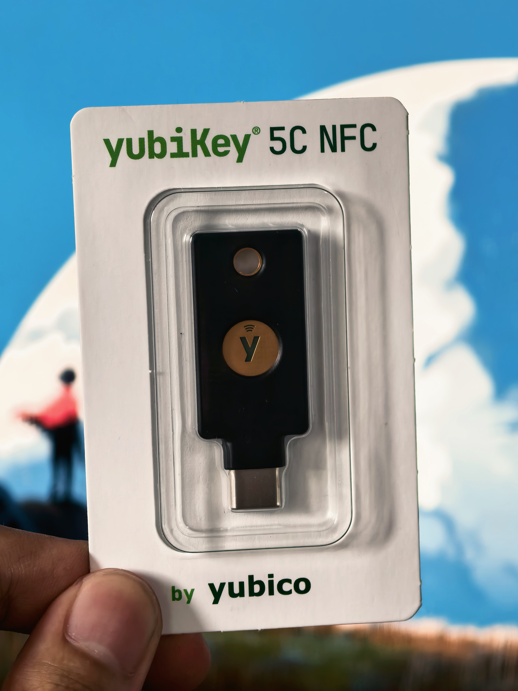

---
{
  title: Yubikey 5C NFC 上手 & SSH 登录认证,
  description: 本文记录 YubiKey 5C NFC 上手体验，对比 CanoKey 的优劣，并详解如何借助 FIDO2 生成硬件密钥实现 SSH 登录认证，包括驻留密钥与 Windows 使用。,
  date: 2026-09-23,
  tags: [ Security ],
  draft: false,
  archive: true
}
---

在前几天军训期间收到了之前淘的 YUbikey 5C NFC （5.8 固件），折腾了几天之后发现和 Canokey 实现的功能差不了多少，甚至下文要说的 SSH 登录 Canokey 也可以做到，但还是写一篇 Blog 记录一下好了

## YubiKey 相对 CanoKey 的优点

CanoKey 作为国产开源硬件密钥，以极低的价格（约 100~200 元人民币）做到了 Yubikey 80% 的体验。实际使用中，YubiKey 还是有几个 CanoKey 目前难以匹敌的优势。

### NFC 性能
CanoKey 的 NFC 功率设计较小，有时候贴上去无论怎么调整都一点反应都没有。而 YubiKey 的 NFC 体验则基本没有遇到障碍。如果你打算在手机上使用硬件密钥进行 Passkey 登录或 2FA，NFC 体验的差距是选择时需要重点考虑的。

### Yubico OTP
Yubico OTP 是 Yubikey 专有机制，需要请求 Yubico Cloud，这点 Canokey 客观上做不到，但使用频率很低，目前只看到 Bitwarden 可以用

### 安全元素与认证
YubiKey 内置专用安全元素（Secure Element），并已通过 NIST AAL3 标准验证。CanoKey 的 nRF52 版本官方明确声明“绝对不提供任何安全保证或担保”。

## 通过 FIDO2 进行 SSH 登录认证
借助 OpenSSH 8.2+ 对 FIDO2 硬件密钥的原生支持，你可以生成一个由 YubiKey 保护的 SSH 密钥，每次 SSH 认证时都需要物理接触 YubiKey 才能完成签名。私钥材料由 YubiKey 中的密钥加密保护，没有 YubiKey 就无法完成认证。

### 前置条件
YubiKey 5 系列（固件 5.2.3+ 支持 ed25519-sk）

OpenSSH 8.2 或更新版本

本地安装 yubikey-manager（用于管理 FIDO2 PIN）

检查 OpenSSH 版本和算法支持：

~~~bash
ssh -V
ssh -Q PubkeyAcceptedAlgorithms | grep sk-ssh-ed25519@openssh.com
~~~

### 生成 SSH 密钥
将 YubiKey 插入电脑，生成 FIDO2 硬件密钥：

~~~bash
ssh-keygen -t ed25519-sk -C "your@email.com"
~~~

执行后会依次提示：

1. 输入 FIDO2 PIN（即上一步设置的 PIN）

2. 指定密钥文件名（默认 ~/.ssh/id_ed25519_sk 即可）

3. Passphrase：直接回车跳过，密钥的安全由 YubiKey 的物理存在保障
4. 触摸 YubiKey：钥匙会闪烁，触摸确认即可

生成后会得到两个文件：

- `~/.ssh/id_ed25519_sk`：密钥句柄（加密的凭据存根，需要 YubiKey 才能解密）

- `~/.ssh/id_ed25519_sk.pub`：公钥（需要上传到服务器）

### 使用驻留密钥（Resident Key）
默认生成的密钥是非驻留式的——句柄文件存储在电脑上，YubiKey 仅作为解密密钥。如果你希望在多台设备之间使用同一把 YubiKey 而不用手动复制句柄文件，可以生成驻留密钥：

~~~bash
ssh-keygen -t ed25519-sk -O resident -O application=ssh:MyKey -C "your@email.com"
~~~

驻留密钥将凭据直接存储在 YubiKey 上。换一台电脑后，只需插入 YubiKey 并执行：

~~~bash
ssh-keygen -K
~~~

即可从 YubiKey 中恢复出密钥文件。ssh-keygen -K 会将驻留密钥下载到当前目录，之后即可正常使用。

### 部署公钥到服务器
将公钥内容追加到服务器的 ~/.ssh/authorized_keys 中：

~~~bash
ssh-copy-id -i ~/.ssh/id_ed25519_sk.pub user@server
~~~

### 连接测试
~~~bash
ssh -i ~/.ssh/id_ed25519_sk user@server
~~~

首次连接时会提示输入 FIDO2 PIN，然后触摸 YubiKey 完成认证。之后每次 SSH 登录都需要插入 YubiKey 并触摸确认——即使 PIN 被泄露，没有物理钥匙也无法完成认证。

### Windows 下使用 SSH-Agent

Windows 下用密钥进行签名，需要用 SSH-Agent 进行转发，所以要么直接在终端使用 OpenSSH 进行连接，要么就使用 Termius 之类支持 SSH-Agent 进行登录验证的 SSH 客户端

## 小结
YubiKey 5C NFC 是一款做工扎实、功能全面的硬件安全密钥。USB-C + NFC 双接口的设计让它在笔记本和手机之间切换自如，FIDO2/WebAuthn、PIV、OpenPGP、TOTP 等多协议支持覆盖了从个人账号保护到企业级身份认证的绝大多数场景。

相比 CanoKey，YubiKey 的核心优势在于 NFC 体验的可靠性、硬件做工与耐久度、安全元素的认证背书，以及更成熟的生态兼容性。CanoKey 在“够用”层面确实能以极低价格提供相近的功能，但如果 NFC 使用频率高、或者对设备可靠性有较高要求，YubiKey 仍然是更稳妥的选择。
